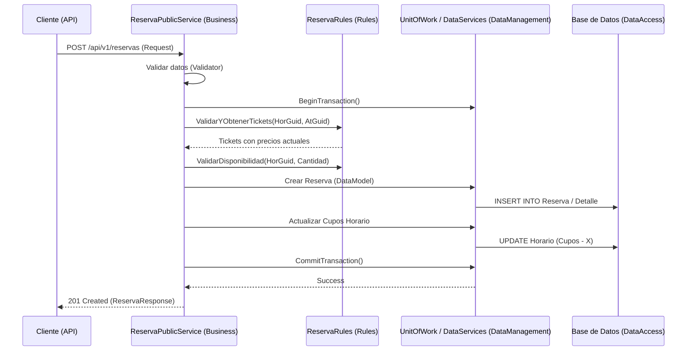
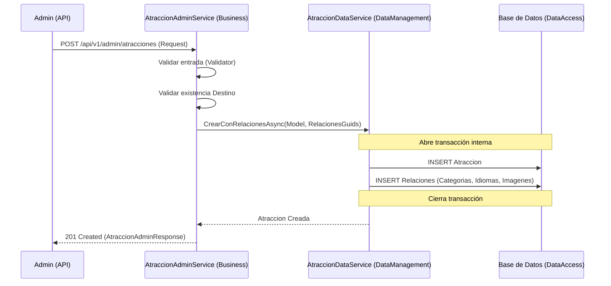

# Documentación del Proyecto: Microservicio Atracciones

Este documento detalla la arquitectura, estructura de carpetas y flujos principales del microservicio de Atracciones. El proyecto sigue una arquitectura de N-Capas (4 capas) para garantizar la separación de responsabilidades, mantenibilidad y escalabilidad.

---

## 1. Resumen General de las Capas

El microservicio está dividido en las siguientes 4 capas lógicas:

1.  **DataAccess (Capa de Acceso a Datos):** Es la capa más interna que interactúa directamente con la base de datos SQL Server mediante Entity Framework Core. Contiene el contexto de base de datos, las entidades que mapean a las tablas y los repositorios básicos para operaciones CRUD.
2.  **DataManagement (Capa de Gestión de Datos):** Actúa como un puente entre la persistencia y la lógica de negocio. Orquesta los repositorios mediante el patrón *Unit of Work* y proporciona servicios de datos que transforman entidades en modelos internos, manejando la lógica de persistencia sin reglas de negocio complejas.
3.  **Business (Capa de Lógica de Negocio):** Contiene el núcleo funcional del sistema. Aquí se implementan las validaciones, reglas de dominio, orquestación de servicios y el mapeo a objetos de transferencia de datos (DTOs). Está dividida en servicios para Administradores, Usuarios Públicos y Autenticación.
4.  **Api (Capa de Presentación):** Es el punto de entrada al microservicio. Expone endpoints RESTful, gestiona la seguridad (JWT), maneja excepciones globales, implementa caché y proporciona la documentación interactiva a través de Swagger.

---

## 2. Capa: DataAccess

**Propósito:** Encapsular toda la lógica relacionada con la base de datos y la persistencia de objetos.

### Estructura de la Capa
```text
Microservicio.Atracciones.DataAccess
│
├── Context
│   └── AtraccionesDbContext.cs      # Configuración del DbContext y DbSets.
│
├── Entities                         # Clases POCO que representan las tablas de la BD.
│   ├── Atracciones                  # Entidades: Atraccion, Categoria, Idioma, Imagen, etc.
│   ├── Auditoria                    # Entidades para logs y seguimiento.
│   ├── Clientes                     # Entidades: Cliente.
│   ├── Reservas                     # Entidades: Reserva, ReservaDetalle.
│   └── Seguridad                    # Entidades: Usuario, Rol, Permiso.
│
├── Repositories                     # Implementación de patrones de acceso a datos.
│   ├── Interfaces                   # Definición de contratos para repositorios.
│   └── AtraccionRepository.cs       # Operaciones específicas de la base de datos.
│
└── Configurations                   # Mapeo Fluent API para configurar la BD.
```

### Clases Principales
- **AtraccionesDbContext:** Clase central que gestiona la conexión a la base de datos y define las relaciones entre entidades.
- **Entities (Atraccion, Reserva, etc.):** Representan el esquema de la base de datos. No contienen lógica de negocio.
- **Repositories:** Implementan la lógica de consulta y persistencia física (Select, Insert, Update, Delete) utilizando LINQ y Entity Framework.

---

## 3. Capa: DataManagement

**Propósito:** Proporcionar una abstracción limpia de los datos para la capa de negocio, permitiendo desacoplar las entidades de base de datos del flujo de negocio.

### Estructura de la Capa
```text
Microservicio.Atracciones.DataManagement
│
├── Interfaces                       # Contratos de los servicios de gestión de datos.
│
├── Models                           # Modelos de datos enriquecidos para la lógica interna.
│   ├── Atracciones
│   └── Reservas
│
├── Services                         # Orquestación de repositorios.
│   ├── AtraccionDataService.cs      # CRUD avanzado y consultas filtradas.
│   ├── ReservaDataService.cs        # Gestión de persistencia de reservas.
│   └── UnitOfWork.cs                # Garantiza que múltiples operaciones sean atómicas.
│
└── Mappers                          # Mapeo entre Entities y Modelos de Datos.
```

### Clases Principales
- **UnitOfWork:** Implementa el patrón Unidad de Trabajo para manejar transacciones distribuidas entre múltiples repositorios.
- **DataServices:** Consumen los repositorios de DataAccess. Su función es preparar los datos para la capa de negocio, realizando conversiones y asegurando la integridad referencial básica.

---

## 4. Capa: Business

**Propósito:** Implementar la lógica de negocio y las reglas que rigen el funcionamiento de la aplicación.

### Estructura de la Capa
```text
Microservicio.Atracciones.Business
│
├── DTOs                             # Objetos para enviar/recibir datos por la API.
│   ├── Admin                        # Requests/Responses para administración.
│   └── Public                       # Requests/Responses para el flujo público.
│
├── Services                         # Implementación de lógica de negocio.
│   ├── Admin                        # Servicios para gestión de catálogo (AtraccionAdminService).
│   ├── Public                       # Servicios para clientes (ReservaPublicService).
│   └── Auth                         # Servicios de autenticación y tokens.
│
├── Rules                            # Reglas de dominio específicas (Validar disponibilidad, precios).
│
├── Validators                       # Validaciones de entrada de datos (FluentValidation).
│
└── Mappers                          # Mapeo de Modelos de Datos a DTOs.
```

### Clases Principales
- **Services (Admin/Public):** Contienen el flujo de trabajo de cada caso de uso. Invocan validadores, aplican reglas y coordinan con DataManagement para persistir cambios.
- **Rules:** Lógica que no pertenece a un solo servicio, como el cálculo de impuestos o validación de cupos en tiempo real.
- **Validators:** Aseguran que los datos recibidos del cliente cumplan con el formato y restricciones requeridas antes de procesarlos.

---

## 5. Capa: Api

**Propósito:** Interfaz de comunicación con el exterior y manejo de preocupaciones transversales (Cross-cutting concerns).

### Estructura de la Capa
```text
Microservicio.Atracciones.Api
│
├── Controllers                      # Endpoints organizados por versiones y módulos.
│   └── V1
│       ├── Internal                 # Endpoints administrativos (Privados).
│       ├── Booking                  # Endpoints de reserva y catálogo (Públicos).
│       └── Auth                     # Endpoints de inicio de sesión.
│
├── Middleware                       # Manejo de excepciones, logs y autenticación.
│
├── Filters                          # Atributos para autorizaciones personalizadas.
│
└── Program.cs                       # Configuración de servicios y pipeline de ASP.NET Core.
```

### Clases Principales
- **Controllers:** Reciben los HTTP Requests, extraen información del usuario/IP y llaman a la capa Business. No contienen lógica de negocio.
- **Middleware:** Gestionan aspectos como el "Global Error Handling" para retornar respuestas consistentes en caso de fallos.

---

## 6. Listado de Endpoints

### Endpoints Administrativos (Requieren Rol: Admin)
| Método | Endpoint | Funcionalidad Breve |
| :--- | :--- | :--- |
| `GET` | `/api/v1/admin/atracciones` | Lista atracciones con filtros detallados para gestión. |
| `POST` | `/api/v1/admin/atracciones` | Crea una nueva atracción con sus imágenes, idiomas y categorías. |
| `PUT` | `/api/v1/admin/atracciones/{guid}` | Actualiza todos los datos de una atracción existente. |
| `DELETE` | `/api/v1/admin/atracciones/{guid}` | Elimina de forma lógica una atracción. |
| `GET` | `/api/v1/admin/catalogos` | Obtiene catálogos maestros para llenar formularios (idiomas, categorías). |
| `GET` | `/api/v1/admin/reservas` | Consulta el historial global de reservas realizadas. |

### Endpoints Públicos (Acceso Abierto / Cliente)
| Método | Endpoint | Funcionalidad Breve |
| :--- | :--- | :--- |
| `GET` | `/api/v1/atracciones` | Listado paginado de atracciones para el usuario final. |
| `GET` | `/api/v1/atracciones/{guid}` | Detalle completo de una atracción específica. |
| `POST` | `/api/v1/reservas` | Crea una reserva (permite clientes invitados o autenticados). |
| `GET` | `/api/v1/reservas/{guid}` | Obtiene el detalle de una reserva específica del cliente. |
| `POST` | `/api/v1/auth/login` | Autenticación de usuarios para obtener token JWT. |
| `GET` | `/api/v1/atracciones/filtros` | Obtiene opciones de filtrado dinámico según la ciudad seleccionada. |

---

## 7. Diagramas de Secuencia

### Flujo de Reserva (Creación de Reserva)
Este flujo muestra cómo interactúan las capas cuando un cliente realiza una reserva.



### Flujo de Creación de Atracción (Admin)
Muestra la creación de una atracción junto con sus relaciones complejas.


