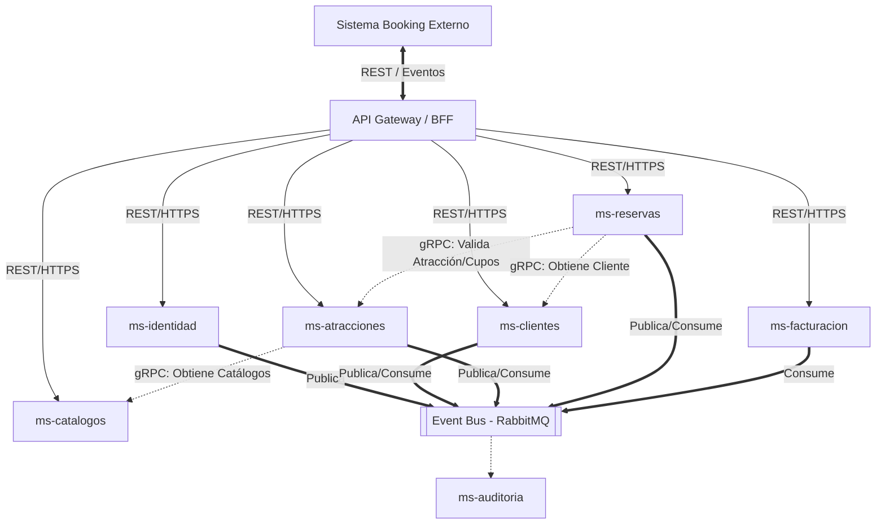

# Arquitectura de Descomposición a Microservicios: Sistema de Atracciones

## 1. Visión general de la descomposición

El sistema actual está construido como un **monolito de base de datos** disfrazado de microservicio. Aunque se denomine "Microservicio.Atracciones", al centralizar múltiples dominios dispares (identidad, facturación, reservas, catálogo) en un único esquema de base de datos (`atracciones`) y en un solo proceso de despliegue, sufre de un alto acoplamiento. Cualquier cambio en facturación puede afectar el rendimiento o despliegue de las atracciones.

**Bounded Context (Contexto Delimitado):**
En el Diseño Guiado por el Dominio (DDD), un Bounded Context define los límites explícitos dentro de los cuales un modelo de dominio es válido. Al aplicar esto a nuestro sistema, separamos las responsabilidades en fronteras transaccionales independientes. Por ejemplo, "Usuario" en Identidad significa credenciales; en Reservas significa "Cliente" con un historial de compras.

Para lograr una verdadera arquitectura de microservicios, debemos dividir el sistema en servicios autónomos, cada uno con su propio almacenamiento (evitando integraciones a nivel de base de datos) y comunicándose a través de contratos de red bien definidos (gRPC para consultas síncronas y Eventos para actualizaciones asíncronas).

### Ecosistema de Microservicios



---

## 2. Catálogo de microservicios

A continuación se definen los microservicios resultantes, ajustando el alcance sugerido para mantener la cohesión.

### 2.1. ms-identidad

#### a) Descripción del bounded context
- **Responsabilidad:** Gestión de credenciales, autenticación (emisión de JWT) y autorización base (roles).
- **Source of Truth:** Posee las credenciales y el estado de la cuenta de acceso.
- **Consume de otros:** Ninguno.

#### b) Base de datos propia
- **Schema:** `auth`
- **Tablas:** `usuarios` (usu_guid, usu_correo, usu_password_hash, usu_estado), `roles` (rol_guid, rol_nombre), `usuario_roles`.
- **Sin FK cruzadas:** Emite el `usu_guid` en el token JWT (claim `sub`). Los demás servicios usarán este GUID para relacionarlo con sus propias entidades (ej. `cli_guid` en Clientes será el mismo `usu_guid`).
- **SQL de Creación:**
```sql
CREATE SCHEMA IF NOT EXISTS auth;
CREATE TABLE auth.usuarios (
    usu_guid UUID PRIMARY KEY DEFAULT gen_random_uuid(),
    usu_correo VARCHAR(150) UNIQUE NOT NULL,
    usu_password_hash VARCHAR(255) NOT NULL,
    usu_estado VARCHAR(20) DEFAULT 'ACTIVO'
);
CREATE TABLE auth.roles (
    rol_guid UUID PRIMARY KEY DEFAULT gen_random_uuid(),
    rol_nombre VARCHAR(50) UNIQUE NOT NULL
);
CREATE TABLE auth.usuario_roles (
    usu_guid UUID REFERENCES auth.usuarios(usu_guid),
    rol_guid UUID REFERENCES auth.roles(rol_guid),
    PRIMARY KEY (usu_guid, rol_guid)
);
```

#### c) Arquitectura interna
- **Carpetas:** `Api`, `Business`, `DataManagement`, `DataAccess`.
- **Controladores:** `Public` (Login, Register).
- **Endpoints:**
  - `POST /api/v1/auth/login` - Autentica y retorna JWT.
  - `POST /api/v1/auth/register` - Crea cuenta de usuario.

#### d) Comunicación
- **gRPC:** Servidor (Valida tokens si es necesario, aunque se prefiere validación asimétrica local).
- **Eventos:**
  - Publica: `identidad.usuario.registrado` (Payload: `{ "usu_guid": "...", "correo": "..." }`)

---

### 2.2. ms-clientes

#### a) Descripción del bounded context
- **Responsabilidad:** Perfil comercial y personal del usuario.
- **Source of Truth:** Nombres, identificación, información de contacto.
- **Consume de otros:** `usu_guid` desde el JWT.

#### b) Base de datos propia
- **Schema:** `crm`
- **Tablas:** `clientes` (cli_guid, cli_nombres, cli_apellidos, cli_correo, cli_identificacion). *Nota: `cli_guid` coincide con `usu_guid`.*
- **SQL de Creación:**
```sql
CREATE SCHEMA IF NOT EXISTS crm;
CREATE TABLE crm.clientes (
    cli_guid UUID PRIMARY KEY, -- Viene de ms-identidad
    cli_nombres VARCHAR(100) NOT NULL,
    cli_apellidos VARCHAR(100) NOT NULL,
    cli_correo VARCHAR(150) UNIQUE NOT NULL,
    cli_tipo_identificacion VARCHAR(20),
    cli_identificacion VARCHAR(50),
    cli_estado VARCHAR(20) DEFAULT 'ACTIVO'
);
```

#### c) Arquitectura interna
- **Controladores:** `Cliente` (Mi Perfil), `Admin` (Gestión de clientes).
- **Endpoints:**
  - `GET /api/v1/clientes/me` (Protegido: JWT)
  - `PUT /api/v1/clientes/me` (Protegido: JWT)

#### d) Comunicación
- **gRPC:** Servidor para que `ms-reservas` consulte datos del cliente al crear una reserva.
  - Protobuf: `GetClienteRequest { string cli_guid = 1; }`
- **Eventos:**
  - Consume: `identidad.usuario.registrado` (Crea perfil base del cliente).
  - Publica: `clientes.cliente.actualizado`.

---

### 2.3. ms-catalogos

#### a) Descripción del bounded context
- **Responsabilidad:** Gestión de datos maestros estáticos o de baja mutación.
- **Source of Truth:** Destinos, categorías, idiomas, elementos de inclusión, imágenes globales.
- **Consume de otros:** Ninguno.

#### b) Base de datos propia
- **Schema:** `catalogos`
- **Tablas:** `destino`, `categorias`, `idiomas`, `incluye`. Todas referenciadas por `guid`.
- **SQL de Creación:**
```sql
CREATE SCHEMA IF NOT EXISTS catalogos;
CREATE TABLE catalogos.destino (
    des_guid UUID PRIMARY KEY DEFAULT gen_random_uuid(),
    des_nombre VARCHAR(100) NOT NULL,
    des_pais VARCHAR(100) NOT NULL,
    des_estado VARCHAR(20) DEFAULT 'ACTIVO'
);
-- ... (tablas similares para categorias, idiomas, incluye)
```

#### c) Arquitectura interna
- **Controladores:** `Public` (Lectura), `Admin` (CRUD).
- **Endpoints:** `GET /api/v1/destinos`, `GET /api/v1/categorias`.

#### d) Comunicación
- **gRPC:** Servidor para que `ms-atracciones` obtenga los nombres de categorías/destinos para visualización.
  - Protobuf: `GetCatalogosRequest { repeated string cat_guids = 1; }`
- **Eventos:** Publica `catalogos.categoria.creada`, etc. (Baja frecuencia).

---

### 2.4. ms-atracciones (Core Domain)

#### a) Descripción del bounded context
- **Responsabilidad:** Catálogo de productos turísticos, configuración de tickets, disponibilidad y cupos, y recolección de reseñas.
- **Source of Truth:** Atracciones, Tickets, Horarios, Reseñas.
- **Consume de otros:** Destinos, Categorías (via gRPC o caché de eventos).

#### b) Base de datos propia
- **Schema:** `inventario`
- **Tablas:** `atracciones` (sin FK a destinos, solo `des_guid`), tablas pivote con `guid` (ej. `atraccion_categoria` almacena `atr_guid` y `cat_guid`), `tickets`, `horarios`, `resenias`.
- **Sin FK cruzadas:** El campo `des_guid` en `atracciones` no tiene FK a `ms-catalogos`. Se valida consistencia por gRPC al crear o mediante eventos.
- **SQL de Creación:**
```sql
CREATE SCHEMA IF NOT EXISTS inventario;
CREATE TABLE inventario.atracciones (
    atr_guid UUID PRIMARY KEY DEFAULT gen_random_uuid(),
    atr_nombre VARCHAR(200) NOT NULL,
    des_guid UUID NOT NULL, -- Referencia débil a ms-catalogos
    atr_precio_base DECIMAL(10,2),
    atr_estado VARCHAR(20) DEFAULT 'ACTIVO'
);
CREATE TABLE inventario.horarios (
    hor_guid UUID PRIMARY KEY DEFAULT gen_random_uuid(),
    tck_guid UUID NOT NULL,
    hor_fecha_hora TIMESTAMP NOT NULL,
    hor_cupos_total INT NOT NULL,
    hor_cupos_disponibles INT NOT NULL
);
```

#### c) Arquitectura interna
- **Controladores:** `Public` (Búsqueda, Filtros), `Admin` (Gestión de inventario).
- **Endpoints:** `GET /api/v1/atracciones`, `GET /api/v1/atracciones/{guid}/horarios-disponibles`.

#### d) Comunicación
- **gRPC:**
  - Cliente: Consulta `ms-catalogos` para enriquecer respuestas.
  - Servidor: Provee validación de cupos y precios para `ms-reservas`.
- **Eventos:**
  - Consume: `reservas.reserva.creada` (para restar cupos asíncronamente si se usa compensación).
  - Publica: `atracciones.horario.cupo_agotado`.

---

### 2.5. ms-reservas

#### a) Descripción del bounded context
- **Responsabilidad:** Orquestación del proceso de compra, carrito y estado de la reserva.
- **Source of Truth:** Reservas y sus detalles.
- **Consume de otros:** Precios y disponibilidad (`ms-atracciones`), Cliente (`ms-clientes`).

#### b) Base de datos propia
- **Schema:** `ventas`
- **Tablas:** `reservas` (`rev_guid`, `cli_guid` débil), `reserva_detalle` (`rdet_guid`, `rev_guid`, `tck_guid` débil, `hor_guid` débil).
- **SQL de Creación:**
```sql
CREATE SCHEMA IF NOT EXISTS ventas;
CREATE TABLE ventas.reservas (
    rev_guid UUID PRIMARY KEY DEFAULT gen_random_uuid(),
    cli_guid UUID, -- Referencia débil a ms-clientes
    rev_estado VARCHAR(30) DEFAULT 'PENDIENTE_PAGO',
    rev_total DECIMAL(10,2) NOT NULL
);
```

#### c) Arquitectura interna
- **Controladores:** `Cliente` (Mis reservas, Crear reserva).
- **Endpoints:** `POST /api/v1/reservas` (Expuesto a Booking Externo).

#### d) Comunicación
- **gRPC:** Cliente de `ms-atracciones` (Valida si el `hor_guid` tiene cupos y el precio actual). Cliente de `ms-clientes`.
- **Eventos:**
  - Publica: `reservas.reserva.creada` (Inicia saga/coreografía), `reservas.reserva.pagada`.

---

### 2.6. ms-facturacion

#### a) Descripción del bounded context
- **Responsabilidad:** Emisión de comprobantes fiscales y registro de cobros.
- **Source of Truth:** Facturas.
- **Consume de otros:** Datos de la reserva (`ms-reservas`).

#### b) Base de datos propia
- **Schema:** `billing`
- **Tablas:** `facturas` (`fac_guid`, `rev_guid` débil), `datos_facturacion`.
- **SQL de Creación:** (Omitido por brevedad, sigue mismo patrón de GUIDs).

#### d) Comunicación
- **Eventos:** Consume `reservas.reserva.pagada` -> Automáticamente genera la factura. Emite `facturacion.factura.emitida`.

---

### 2.7. ms-auditoria

#### a) Descripción del bounded context
- **Responsabilidad:** Registro inmutable de acciones críticas (Log transversal).
- **Base de datos:** Schema `audit` optimizado para inserciones (append-only) o base NoSQL (Elasticsearch/MongoDB si el volumen es alto).
- **Comunicación:** Exclusivamente consume eventos del bus (wildcard `*.*.*`) y los almacena.

---

## 3. Diseño del Bus de Eventos

El bus de eventos desacopla los servicios, mejora la resiliencia y permite flujos reactivos. 

- **Topología Recomendada:** RabbitMQ usando **Topic Exchanges** (`atracciones.events`). Las colas se vinculan con routing keys específicas (ej. `reservas.reserva.*`).
- **Patrón Outbox:** Para evitar el problema de dual-write (guardar en BD y publicar en RabbitMQ, donde uno puede fallar), cada microservicio tendrá una tabla `outbox_events`. En una misma transacción de BD se guarda la entidad (ej. Reserva) y el evento en `outbox_events`. Un worker en background (o Debezium) lee esta tabla y publica a RabbitMQ de forma segura.

### Catálogo de Eventos (Ejemplo)

**Evento:** `reservas.reserva.creada`
```json
{
  "event_id": "123e4567-e89b-12d3-a456-426614174000",
  "event_type": "reservas.reserva.creada",
  "timestamp": "2025-07-01T14:30:00Z",
  "correlation_id": "abc-123",
  "payload": {
    "rev_guid": "...",
    "cli_guid": "...",
    "total": 150.00,
    "detalles": [
      { "hor_guid": "...", "cantidad": 2 }
    ]
  }
}
```

---

## 4. Integración con el sistema Booking externo

El equipo externo de Booking interactuará con nuestro ecosistema unificado a través del API Gateway.

- **Endpoints Expuestos (Síncrono):**
  - Los definidos en `openapi-v2-booking-public.md` (Catálogo de atracciones, Creación de Reservas, Cancelaciones).
- **Consumo de Eventos (Asíncrono):**
  - Booking puede suscribirse a un Webhook o una cola en RabbitMQ para escuchar `atracciones.horario.cupo_agotado` (para que bajen la disponibilidad en su frontend) o `reservas.reserva.confirmada`.
- **Autenticación B2B:** Uso de **mTLS** (Mutual TLS) en el API Gateway o un **JWT de Servicio** (Client Credentials Flow de OAuth2) emitido por `ms-identidad` con roles específicos de "Sistema Externo".

---

## 5. Estrategia de migración desde el monolito

Patrón **Strangler Fig** (Higuera Estranguladora):

1. **Fase 1: Preparación (API Gateway & Auth):** Desplegar el API Gateway y extraer `ms-identidad`. Modificar el monolito para que valide los JWT del nuevo microservicio.
2. **Fase 2: Extracción Periférica:** Extraer `ms-catalogos` y `ms-clientes`. El monolito se conectará a ellos vía gRPC para consultas que antes resolvía con JOINs.
3. **Fase 3: Separación Transaccional:** Extraer `ms-facturacion`. Hacer que escuche eventos del monolito para generar facturas.
4. **Fase 4: Desacoplar el Core:** Separar `ms-atracciones` y `ms-reservas`. Las antiguas FK de la base de datos se eliminan.
5. **Transición de BD:** Usar migración de datos con ventanas de mantenimiento, o replicación lógica CDC (Change Data Capture) para mantener esquemas sincronizados temporalmente.

---

## 6. Consideraciones técnicas transversales

- **Sin FK cruzadas (Integridad Referencial):** Cuando se borra una categoría en `ms-catalogos`, se publica `catalogos.categoria.eliminada`. `ms-atracciones` escucha el evento y elimina la relación en su tabla pivote local (Consistencia Eventual).
- **Identidad distribuida:** `ms-identidad` firma el JWT con clave privada (RS256). Los demás microservicios tienen la clave pública y validan el token localmente en cada request sin consultar a `ms-identidad`.
- **Trazabilidad:** El API Gateway genera un header `X-Correlation-ID`. Este ID fluye por las peticiones HTTP, llamadas gRPC y se inyecta en la metadata de los eventos de RabbitMQ. `ms-auditoria` indexa usando este ID.
- **Idempotencia:** Cada microservicio que consume eventos registra el `event_id` en una tabla `eventos_procesados`. Si llega un evento duplicado, se ignora. En APIs REST (ej. Pagar Reserva), se usa un header `Idempotency-Key`.
- **Versionamiento:** Los contratos gRPC y esquemas de eventos no deben tener cambios que rompan compatibilidad (Breaking Changes). Los campos nuevos son opcionales (`optional`). Si es obligatorio, se crea un paquete `v2` en el `.proto` o un evento `v2.reservas.reserva.creada`.
